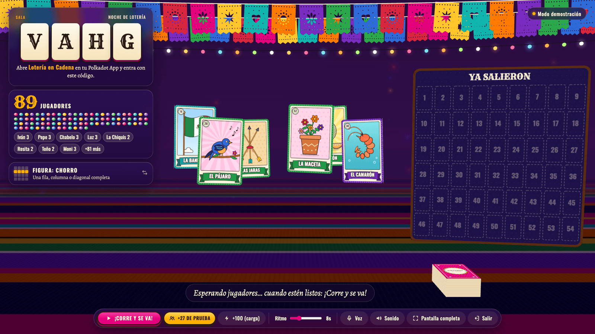
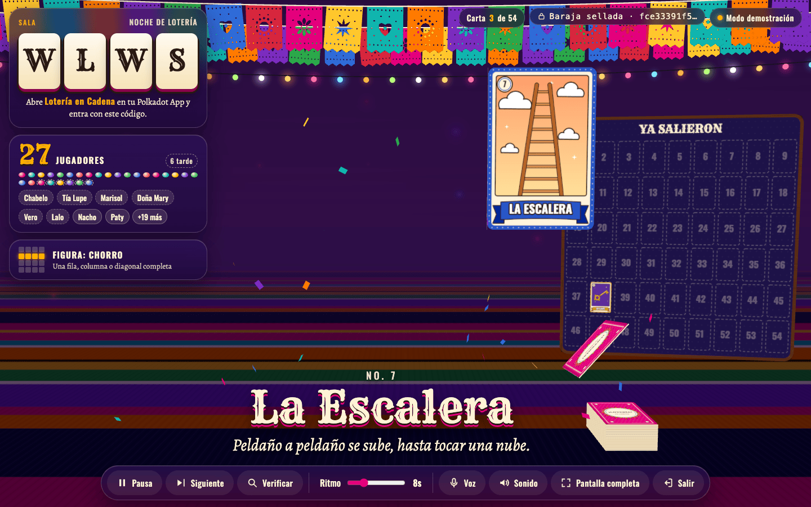
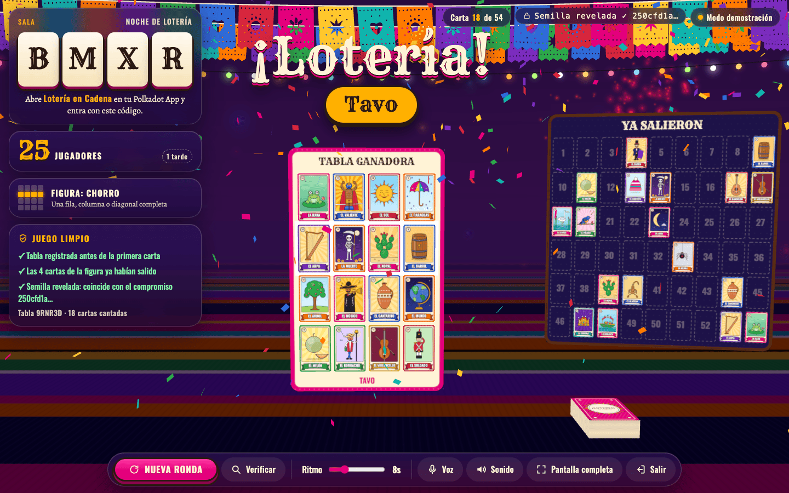
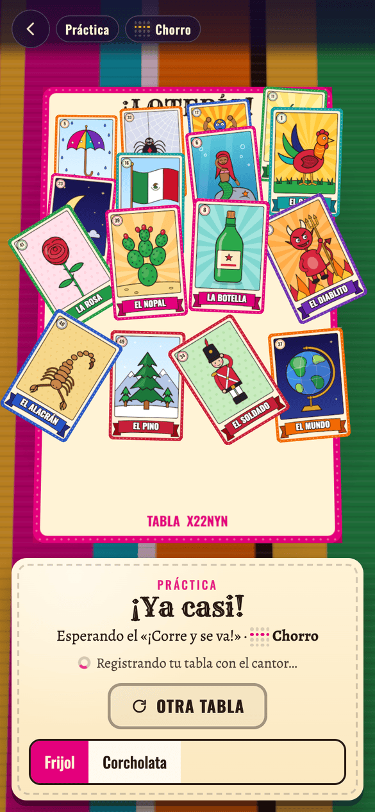
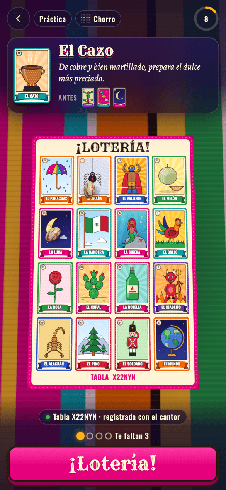
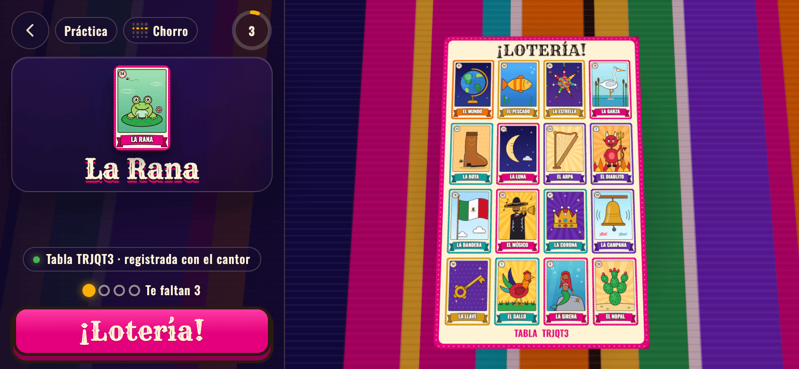

# ¡Lotería en Cadena!

Lotería mexicana en 3D para jugar en persona con toda la sala. Una pantalla grande hace de **cantor** y cada quien juega su **tabla** desde la Polkadot App. Los mensajes viajan por el **Statement Store** de Polkadot: no hay servidor.

- 54 cartas con ilustraciones y versos originales.
- Pantalla del cantor en three.js: mazo, carta que vuela y gira, tablero de "ya salieron", papel picado, foquitos, confeti y fuegos artificiales.
- Tabla 3D en el teléfono: tocas la carta cantada y cae un frijolito (o una corcholata).
- Figuras: chorro, cuatro esquinas, centrito y tabla llena.
- Juego limpio verificable: la baraja se sella con un compromiso SHA-256 y las tablas se registran con un hash antes de empezar.
- Modo práctica contra la compu y modo demostración con 27 jugadores simulados (o 100, para probar una sala grande).
- **Sala grande**: probada con 250 jugadores simulados con red mala (ver [Salas grandes](#salas-grandes-25-jugadores-o-más)).

## Capturas

Pantalla del cantor con 89 jugadores (proyector 1080p) · así se ve la sala:



| Cantor: partida | Cantor: ganador |
|---|---|
|  |  |

| Teléfono: espera | Teléfono: partida | Teléfono horizontal |
|---|---|---|
|  |  |  |

Más: [portada](docs/capturas/01-portada-escritorio.png) · [tableta](docs/capturas/08-tableta-juego.png) · [configuración del cantor](docs/capturas/09-cantor-configuracion.png).

## Cómo publicarla

Necesitas Node 20 o más reciente y el CLI de Playground ([guía oficial](https://docs.polkadot.com/apps/quick-start/)).

```bash
curl -fsSL https://raw.githubusercontent.com/paritytech/playground-cli/main/install.sh | bash
pg login                      # escanea el QR con tu Polkadot App
npm install
pg deploy --domain loteriamexicana --playground --tag gaming
```

- El nombre necesita 9 caracteres o más para quedar abierto a cualquiera (de 6 a 8 piden Proof of Personhood).
- En TestNet el dominio queda como `loteriamexicana.paseo`.
- Después de publicar, pon ese nombre en `src/config.js` (`dotName`) y vuelve a publicar: la pantalla del cantor lo mostrará para que la gente sepa dónde entrar.

`npm run build` genera `dist/index.html` (un solo archivo, ~1 MB, 381 KB comprimido) con el SDK de Polkadot incluido.

## La noche del evento

1. **Cantor**: abre la app en Polkadot Desktop (o en `dot.li` con el navegador) conectado al proyector. Toca **Ser el cantor**, elige la figura y el ritmo, y abre la sala. Aparece un código de 4 letras.
2. **Jugadores**: abren la app en su Polkadot App, tocan **Jugar con mi tabla** y eligen la sala de la lista (o escriben el código). Cada tabla queda registrada con el cantor.
3. Cuando estén listos: **¡Corre y se va!** La voz del cantor lee el verso y el nombre de cada carta (si el equipo tiene voces en español); también puedes leerlos tú al micrófono.
4. Cuando alguien canta ¡Lotería!, su teléfono avisa al cantor, la pantalla verifica la tabla sola y celebra.
5. **Nueva ronda** regresa las cartas al mazo; los teléfonos se vuelven a registrar solos.

Atajos del cantor: `Espacio` pausa · `→` siguiente carta · `V` verificar tabla · `F` pantalla completa · `M` silencio · `Enter` empezar.

**Si el aviso no llega** (sin red o sin permiso para publicar en el Statement Store), el teléfono muestra el código de la tabla (6 caracteres). En la pantalla grande usa **Verificar tabla**, escribe el código y declara al ganador.

**Quien llega tarde** puede jugar: si gana, el cantor ve su tabla y la aprueba o la rechaza.

**Si se recarga la pantalla del cantor**, la sala se guarda en ese dispositivo: entra a **Ser el cantor** y toca **Retomar sala** (conserva baraja sellada, cartas cantadas y tablas registradas).

## Juego limpio

- Al empezar, el cantor genera una semilla secreta y publica solo `SHA-256("compromiso:" + semilla)`. El orden de la baraja se deriva de la semilla.
- Cada tabla sale de un código corto. Antes de la primera carta el teléfono publica solo el hash del código; al cantar ¡Lotería! lo revela y el cantor comprueba la figura contra las cartas cantadas.
- Al terminar la ronda el cantor revela la semilla y cada teléfono comprueba que el compromiso coincide y que las cartas salieron en ese orden.

## Salas grandes (25 jugadores o más)

`npm run carga` simula 1 cantor + N jugadores con latencia de 30–450 ms y 8 % de mensajes perdidos, y mide tres momentos críticos: todos entran a la vez, «Nueva ronda» (todos se vuelven a registrar) y un cantor con prisa. Antes y después de esta versión:

| Jugadores | Confirmar a todos | Registros por jugador | Pico de registros en 200 ms | Tablas «tardías» con prisa |
|---:|---|---|---|---|
| 60 | 6.0 s / 5.4 s → **1.9 s / 3.9 s** | 1.8 → **1.3** | 60 → **14** | 10 → **0** |
| 100 | 11.0 s / 15.9 s → **1.7 s / 3.3 s** | 2.6 → **1.4** | 100 → **22** | 6 → **0** |
| 150 | 25.9 s / 35.6 s → **3.9 s / 3.9 s** | 3.6–4.7 → **1.2** | 150 → **37** | 16 → **0** |
| 250 | 49.3 s / 50.7 s → **4.0 s / 4.3 s** | 5.7–5.9 → **1.3** | 250 → **53** | 18 → **0** |

«Confirmar a todos» son dos cifras: entrada simultánea / nueva ronda. Es un solo proceso con un bus en memoria (no el Statement Store real), así que sirve para comparar versiones y encontrar cuellos de botella, no para prometer tiempos en la red del evento.

Qué cambió y por qué:

- **Confirmación de registro con filtro de Bloom.** Antes el estado llevaba las últimas 24 confirmaciones: con 100 personas, 76 no se veían confirmadas y reintentaban cada 5 s. Ahora una sola copia del estado confirma a toda la sala en menos de 512 bytes.
- **Registros escalonados y reintentos rápidos.** Cada teléfono espera un rato al azar (proporcional al tamaño de la sala) antes de registrar su tabla, y reintenta a los 2, 5, 10 s… en vez de a los 5 s fijos.
- **Compuerta de registro.** «¡Corre y se va!» no canta la primera carta hasta que vuelve el 97 % de la ronda anterior (o el 85 % si ya nadie más llega; máximo 8 s más), para que nadie quede con la tabla marcada como tardía.
- **«Retomar sala» estaba roto** (dos métodos `resume` con el mismo nombre): ahora funciona y tiene prueba.

Límites conocidos: el filtro confirma a ~160 tablas «recientes» en el lobby y a 100–150 durante la partida (solo cuentan las que se oyeron en los últimos 30 s, no toda la sala); con más, sigue funcionando pero algunas confirmaciones tardan una vuelta más de reintentos. Un teléfono solo se da por confirmado si se ve en dos estados con sal distinta, así que un falso positivo del filtro (~0.3 %) no lo deja sin registrar. Hasta 3 ganadores empatados se reconocen solos (con 100 jugadores, 4 o más empatan en menos del 3 % de las rondas). **Nada de esto sustituye una prueba con teléfonos reales en la red del evento**: lee [`docs/evento.md`](docs/evento.md).

## Detalles técnicos

- Cada mensaje pesa menos de 512 bytes (el estado del cantor se recorta a 480 aunque la sala sea enorme; el registro y el reclamo de un jugador pesan ~60). Se usan canales "último escribe gana", así cada cuenta tiene uno o dos mensajes vivos y no rebasa el límite del SDK (~1 KB por cuenta).
- El Host firma los mensajes con la cuenta de *allowance* del Product (camino patrocinado); la app pide la asignación al iniciar con `requestResourceAllocation`.
- El cantor republica su estado cada 5 s, así que quien entra tarde se sincroniza en segundos.
- Las confirmaciones viajan como un filtro de Bloom (`src/net/bloom.js`) dentro del estado: solo incluye a quien se oyó en los últimos 30 s y se dimensiona con el espacio libre del mensaje.
- Fuera de un Host (o en la vista previa) la app usa un bus local con la misma semántica; con dos pestañas del mismo navegador (cantor y jugador) puedes probarla completa.
- Si el teléfono no tiene WebGL, la tabla se muestra en 2D.

```
src/cards/     arte de las 54 cartas (canvas) y versos
src/game/      motor del cantor, del jugador, reglas, criptografía y bots
src/net/       protocolo, filtro de confirmaciones, transporte (Statement Store / bus local) y almacenamiento
src/three/     escenas 3D (portada, cantor, tabla del jugador) y efectos
src/ui/        pantallas, sonido y voz
test/          simulación de 30 jugadores, salas de 100, empates y prueba sobre el cliente real del SDK
scripts/       prueba de carga (npm run carga)
docs/          guía para una sala grande
```

```bash
npm run dev      # servidor local en modo demostración (http://127.0.0.1:5174)
npm test         # pruebas del protocolo, del juego y de salas grandes (~2 min)
npm run carga    # mide registro y confirmación con N=100 (cambia N, DROP, LAT)
```

## Créditos

Ilustraciones, versos y diseño originales. **La Cadena** (26) y **La Llave** (38) sustituyen a dos cartas tradicionales que hoy se consideran estereotipos. Tipografías Rye, Oswald y Alegreya (SIL Open Font License), incluidas en el paquete.
