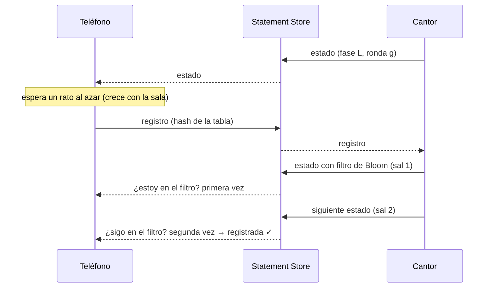

# Arquitectura

Cómo está armado ¡Lotería en Cadena! y por qué. Para tocar el juego sin romper el protocolo.

## Visión general

No hay servidor. Una pantalla (el **cantor**) y N teléfonos (los **jugadores**) se hablan por el
**Statement Store** de Polkadot a través del Host de la Polkadot App. Cada pieza corre en el navegador:

```
 Pantalla del cantor                                   Teléfonos
┌───────────────────┐    Statement Store    ┌──────────────────────┐
│ CantorEngine      │◄──── registros ───────│ PlayerEngine (× N)   │
│  · baraja sellada │───── estado ─────────►│  · tabla propia      │
│  · verifica tablas│◄──── ¡Lotería! ───────│  · marca y reclama   │
└───────────────────┘                       └──────────────────────┘
        │                                              │
   escena 3D + HUD                              tabla 3D + HUD
```

Fuera de un Host (o con `npm run dev`) el mismo código usa un **bus local** con la misma semántica
(canales «último escribe gana», caducidad, repetición del estado vivo), así que cantor y jugador se
prueban en dos pestañas del mismo navegador.

## Mapa del código

| Carpeta | Qué hay | Dependencias |
|---|---|---|
| `src/game/` | Motor sin interfaz: `cantor.js`, `player.js`, `rules.js` (figuras), `crypto.js` (baraja y tablas deterministas), `bots.js` (jugadores simulados), `emitter.js` | `net/`, `@noble/hashes` |
| `src/net/` | `protocol.js` (mensajes y límites), `bloom.js` (confirmaciones), `transport.js` (bus local + detección del Host), `hostTransport.js` (Statement Store), `storage.js` | SDK de Polkadot |
| `src/cards/` | Las 54 cartas: datos y versos (`deck.js`), primitivas de dibujo (`painter.js`), ilustraciones en canvas (`art1-3.js`) | — |
| `src/three/` | Escenas three.js: portada, cantor, tabla del jugador, efectos | `three` |
| `src/ui/` | Pantallas y HUD (`app.js`, `cantorView.js`, `playerView.js`), sonido y voz (`audio.js`), utilidades DOM | `game/`, `three/` |

Regla de dependencias: `game/` no conoce a `ui/` ni a `three/`; se comunica por eventos (`emitter.js`).
Eso permite simular 250 jugadores en Node sin navegador (`npm run carga`).

## Protocolo

Todo mensaje es JSON de menos de **480 bytes** (el límite del Statement Store es 512). El SDK marca cada
statement con `topic1 = blake2b("loteria-en-cadena/v1")` y, aquí, `topic2 = sala/<CÓDIGO>`.

| Mensaje | `t` | Quién lo publica | Canal (último escribe gana) | Contenido |
|---|---|---|---|---|
| Estado | `s` | Cantor | `st/<sala>` | ronda `g`, fase `ph` (`L` lobby · `P` juego · `W` ganó alguien), figura, cartas cantadas, ritmo, compromiso de la baraja, ganadores, filtro de confirmaciones `k` |
| Registro | `j` | Jugador | `j/<sala>/<hash>` | ronda, hash de 8 hex de su tabla, nombre |
| Reclamo | `c` | Jugador | `c/<sala>/<hash>` | ronda, código de 6 caracteres de su tabla, nombre |

Cada cuenta tiene uno o dos mensajes vivos (el estado del cantor; o registro + reclamo de un jugador),
muy por debajo del tope de ~1 KB por cuenta del SDK. El TTL por defecto es de 30 s: el cantor republica
el estado cada 5 s y cada vez que algo cambia, así que quien entra tarde se sincroniza en segundos y un
mensaje perdido se corrige solo. Las cartas cantadas viajan **completas** en cada estado, no como deltas.

## Una ronda

1. **Lobby (`L`).** El cantor abre la sala (código de 4 letras). Cada teléfono genera una tabla desde un
   código corto y registra solo su hash.
2. **Juego (`P`).** El cantor sortea una semilla, publica su compromiso y canta una carta cada N segundos.
   El teléfono comprueba localmente su figura y, si la completa, reclama revelando el código de su tabla.
3. **Ganador (`W`).** El cantor verifica el reclamo contra las cartas cantadas. Si la tabla estaba
   registrada a tiempo gana de inmediato; los empates que lleguen en 6 s se reconocen (hasta 3). Si se
   registró tarde, queda **pendiente** y el cantor la aprueba a mano. Al final revela la semilla.
4. **Nueva ronda.** `g` sube en uno, el cantor olvida los registros y los teléfonos se registran solos.

## Juego limpio (compromiso y revelación)

- **Baraja:** `orden = barajar("baraja", semilla)`, un Fisher–Yates cuyo azar sale de SHA-256 en modo
  contador. El cantor publica `SHA-256("compromiso:" + semilla)` (16 hex) al empezar y la semilla al terminar;
  cada teléfono comprueba que coincide y que las cartas salieron en ese orden.
- **Tabla:** `tabla = barajar("tabla", código)[0..16]`. Registrar solo el hash impide elegir tabla después
  de ver cartas; una tabla registrada con la primera carta ya cantada se marca **tardía** y exige aprobación.

## Salas grandes: registro y confirmación

El cuello de botella no es el juego sino el momento en que todos se registran a la vez.



- **Filtro de Bloom con sal** (`src/net/bloom.js`). El estado lleva un filtro con los hashes oídos en los
  últimos 30 s, dimensionado con el espacio libre del mensaje (caben ~160 tablas en el lobby y 100–150 en
  juego). Cada publicación usa otra sal y el teléfono exige verse en dos con sal distinta: un falso
  positivo (≈0.3 %) deja de bastar (≈0 %).
- **Registros escalonados.** Cada teléfono espera `80 ms + azar × min(4.5 s, 1.2 s + 30 ms × jugadores)`
  (usa la sala más grande que ha visto). Los reintentos son a 1.8, 3.2, 5, 7 y 9 s (±15 %).
- **Compuerta de registro** (`CantorEngine.startGame`). La primera carta espera al tiempo base
  (3.8 s + 40 ms por jugador, hasta +5 s) y, en una ronda nueva, a que vuelva el 97 % de la anterior
  (o el 85 % si ya nadie llega en 3 s), con tope de 8 s más.

Medición y límites: [README → Salas grandes](../README.md#salas-grandes-25-jugadores-o-más) y
[evento.md](evento.md).

## Transportes y almacenamiento

- `createTransport()` detecta si corre dentro de un Host (`@parity/product-sdk-host`); si sí usa
  `HostTransport` (firma con la cuenta de *allowance* del Product y no pide nada al jugador), si no
  `LocalTransport`. La compilación `build:preview` excluye el SDK.
- El cantor guarda su sala (semilla, cartas, registros) en el almacenamiento del dispositivo; **Retomar
  sala** llama a `CantorEngine.restore()`. El jugador guarda nombre, código de tabla y frijolitos.

## Pruebas

| Archivo | Cubre |
|---|---|
| `test/sim.test.mjs` | derivaciones deterministas, tamaño de mensajes, partida completa con 30 jugadores, retomar sala |
| `test/sdk.test.mjs` | la misma partida por el `StatementStoreClient` real del SDK (transporte en memoria) |
| `test/scale.test.mjs` | filtro de Bloom, 100 jugadores en dos rondas, cantor con prisa, empate de 5 |
| `test/check.test.mjs` | que `scripts/check.mjs` realmente falla con enlaces rotos, datos personales, imports rotos… |
| `scripts/check.mjs` | estructura, enlaces, imports, baraja, privacidad, nombres, CI |
| `scripts/carga.mjs` | medición de registro y confirmación con N jugadores |

## Decisiones y límites

- **Hasta 3 ganadores** por ronda: el estado debe caber en 480 bytes. Con 100 jugadores, 4 o más
  empates ocurren en menos del 3 % de las rondas.
- **Un solo reclamo pendiente** a la vez; los demás reintentan (12 veces, cada 3 s).
- **Todo lo que no se puede probar sin red real** está en [evento.md](evento.md).
